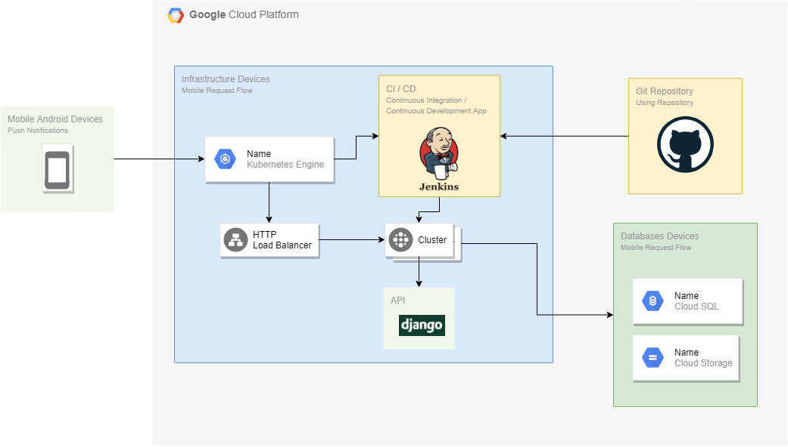
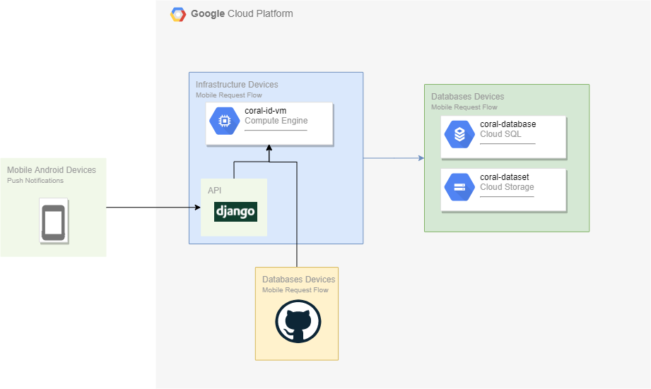

# Coral-ID

**Coral-ID** is an Android application that can classify the taxonomy of corals through uploaded images or images taken. With Coral-ID, we wish to change from the traditional methods of coral identification to the modern method that is much more accurate, cheap, and fast. Therefore, it will help **to understand the ecology of corals and make better preservation plans**. This application also has an objective as a **citizen science project** for coral reefs. Since the coral can be easily identified using a trained model inside the app, anyone can partake in this citizen science project. We wish that through this project, the public will raise their awareness about crucial and threatened marine ecosystems like coral reefs.

# Android
## Screenshots

  
  
  
  

 
 

  
  
  
  

## Features
* **Coral Book :**  show coral catalogue in details
* **Coral Detection:** use machine learning technology for identify and clasify coral species

## Links
* **APK File :** https://drive.google.com/drive/folders/1dbKQViNKph0JLqZ7YBE5QVwT1LwuTt9D?usp=sharing
* **Mockup Design File :** https://www.figma.com/file/hGxOUGbyAReN3L7U0Hn8oH/Coral-ID?node-id=67%3A1257 

## Architecture Diagram
This application strictly follows the below architecture:
 
 

## Tech-Stack
* **Android Jetpack :** https://developer.android.com/jetpack
* **Glide :** https://github.com/bumptech/glide
* **RoundedImageView:** https://github.com/vinc3m1/RoundedImageView
* **Retrofit2 :** https://square.github.io/retrofit/
* **Lottie :** https://github.com/airbnb/lottie-android
* **OkHttp :** https://square.github.io/okhttp/
* **Dagger2 :** https://github.com/google/dagger
* **CameraX :** https://github.com/android/camera-samples/tree/master
* **Zelory Compressor :** https://github.com/zetbaitsu/Compressor
* **Material Design Component :** https://material.io/

***

 

# Project Cloud using GCP (Google Cloud Platform)

## Description

For the first infrastructure design, we used Kubernetes Engine mainly for serving our Django REST API and machine learning model. The reason why we used Kubernetes Engine because we can deploy our code using CI/CD concept by implementing Jenkins and Docker on the process. To configure the Jenkins, we setups a jenkins file based on our reference and modify it, the jenkins file also automatically insert the secret manager value into the settings.py and also build an docker image using container registry. The jenkins file also will deploy it on the kubernetes engine. The design also used Cloud SQL as database for the corals information and also Cloud Storage for saving the images and machine learning model. The infrastructure design will looks like this: 

When working on this infrastructure design, we successfully implemented CI/CD concept into the cloud infrastructure. The problem that we faced when working on this infrastructure is the django code didn’t response as we intended when integrating with machine learning model and also we low on our budgets. 

The second infrastructure design and the design we ended up with, where the main component is using Compute Engine for serving our Django REST API. We used E2 series with machine type e2 medium and operating system Debian. The environment we setup in the Compute Engine was:

- Setting up new user account for running django environment
- Pull the bangkit team repository from Github
- Installing requirements.txt using pip3
- Settings Environment Variables based on our team needs
- Run django services on port 80

The django code we setup to automatically pull machine learning model from github, so we do not need to upload manually into the machine. The design for the infrastructure will looks like this:

## References

- https://www.youtube.com/watch?v=Y_rh-VeC_j4 (dockerizing Django API)
- [https://chriskyfung.github.io/blog/qwiklabs/deploy-to-kubernetes-in-google-cloud-challenge-lab](https://chriskyfung.github.io/blog/qwiklabs/deploy-to-kubernetes-in-google-cloud-challenge-lab)
- [https://chriskyfung.github.io/blog/qwiklabs/Implement-DevOps-in-Google-Cloud-Challenge-Lab](https://chriskyfung.github.io/blog/qwiklabs/Implement-DevOps-in-Google-Cloud-Challenge-Lab)
- [https://medium.com/avmconsulting-blog/kubernetes-ci-cd-using-jenkins-on-google-cloud-5b10da6147a6](https://medium.com/avmconsulting-blog/kubernetes-ci-cd-using-jenkins-on-google-cloud-5b10da6147a6)
- [https://github.com/GoogleCloudPlatform/continuous-deployment-on-kubernetes](https://github.com/GoogleCloudPlatform/continuous-deployment-on-kubernetes)
- [https://cloud.google.com/kubernetes-engine/docs/tutorials/hello-app](https://cloud.google.com/kubernetes-engine/docs/tutorials/hello-app)
- [https://cloud.google.com/architecture/continuous-delivery-jenkins-kubernetes-engine](https://cloud.google.com/architecture/continuous-delivery-jenkins-kubernetes-engine)
- [https://stackoverflow.com/questions/43469281/how-to-predict-input-image-using-trained-model-in-keras](https://stackoverflow.com/questions/43469281/how-to-predict-input-image-using-trained-model-in-keras)

 

***

# Machine Learning
## Data Specification
The dataset is from [StructureRSMAS](https://sci2s.ugr.es/CNN-coral-image-classification) that contains 409 images separated by class and has 14 classes. But since the application is about coral identification, our team focuses on 7 classes (ACER, APAL, CNAT, MALC, MCAV, MMEA, and SSID). For our baseline and transfer learning model, we generate more images using data augmentation (from 256 images to 1898 images).
 
 

 

We also make bounding boxes for the YOLOv4 training model with makesense.ai, in which you can find out more [here](https://makesense.ai).
 
 

## The Approach
In machine learning, we try three different scenarios for training models: baseline from CNN Coursera, transfer learning DenseNet121, and object detection using YOLOv4.
 
 

And here’s the result of each model:
Algorithm | Precision | Recall | F-1 Score
------------ |------------ | ------------- | -------------
Baseline CNN Coursera | 0.10 | 0.11 | 0.10
Transfer Learning DenseNet-121 | 0.15 | 0.17 | 0.15
Object Detection YOLOv4 | **0.81** | **0.81** | **0.81** 

The precision, recall, and F-1 score on the baseline model are really low and the transfer learning only improves them a little bit. Then with YOLOv4, we achieved 81% on precision, recall, and F-1 score and we think this is adequate for our model to run smoothly. Other reasons for using the YOLOv4 model: being able to **detect multiple classes in various conditions fast and accurately**.

## References
* [Bochkovskiy et al., 2020](https://arxiv.org/abs/2004.10934)
* [Gómez-Ríos et al., 2019](http://dx.doi.org/10.1016/j.knosys.2019.104891)
* [Huang et al., 2017](https://arxiv.org/abs/1608.06993)
* [The AI Guy - YOLO4 Cloud Tutorial](https://github.com/theAIGuysCode/YOLOv4-Cloud-Tutorial)

***

# People Behind Coral-ID
## Android
* Eldis Simone - eldisstti@gmail.com 
* Mohammad Arafat Maku - arafat1419@gmail.com 
## Cloud Computing
* Agustinus - agustinus.koo@protonmail.com
* Stephen Nicholas - stephennicholas_23719@protonmail.com 
## Machine Learning
* Dia Marganita - diamarganita@outlook.com
* Shintia Puspita Dewi - shintiapuspitad24@gmail.com 
